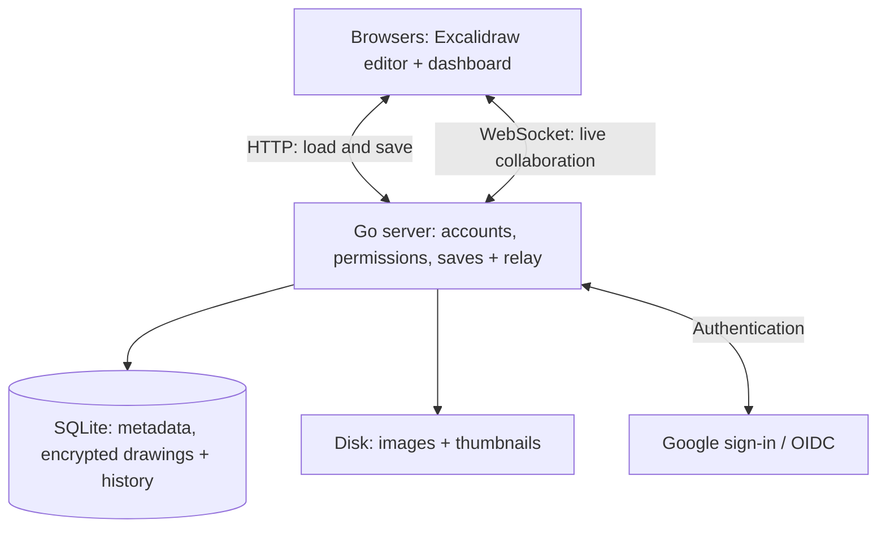

# draw

Self-hosted Excalidraw with saved drawings, live collaboration and link sharing.
A fork of [excalidraw/excalidraw](https://github.com/excalidraw/excalidraw), with
Google sign-in, a dashboard, collections, trash, imports and a synced library.

## Architecture

One Go binary serves the frontend, HTTP API and WebSocket relay. SQLite and a
local data directory hold everything persistent; no Node server or Firebase
is needed at runtime.



The browser handles drawing, encryption and merging collaborators' changes
using Excalidraw's existing code. Go checks access, stores saves and relays live
messages between browsers.

A saved drawing has **scene metadata** (name, owner, sharing) and **room data**
(the encrypted canvas). Saves use a two-second throttle and a revision check:
if another browser saves first, the client fetches, merges and retries.
Sharing can be private, view-only or editable by anyone with the link.

Saved scenes use Excalidraw's encryption format, but the server stores their
keys so it can grant access and duplicate drawings. The server is trusted with
the contents; thumbnails are ordinary PNGs.

## Repository

| Path | Role |
| --- | --- |
| `packages/` | Upstream editor and supporting packages, untouched. |
| `excalidraw-app/` | App shell: dashboard, saved scenes, sharing and adapters replacing Firebase and socket.io. |
| `server/` | Go API, authentication, WebSocket relay, SQLite storage, imports and backups. |
| `flake.nix`, `nix/` | Build the binary with its embedded frontend; configure the NixOS service. |

`/` opens the dashboard, `/s/<id>` opens a saved drawing, and `/local` opens
an account-free local canvas. Drawings retain Excalidraw's file format.

## Run

```sh
nix build .#default
```

Deploy with the `services.draw` NixOS module, or run the binary behind a reverse
proxy. It listens on `127.0.0.1:34729` by default. Google OAuth credentials and a
public base URL are required for production.

See the [server guide](server/README.md) for configuration, development, imports
and backups, and the [specification](SPEC.md) for the full API contract.
A [weekly workflow](.forgejo/workflows/upstream-sync.yml) proposes upstream merges
as Forgejo pull requests.

MIT, as upstream. This is an independent project, unaffiliated with Excalidraw.
